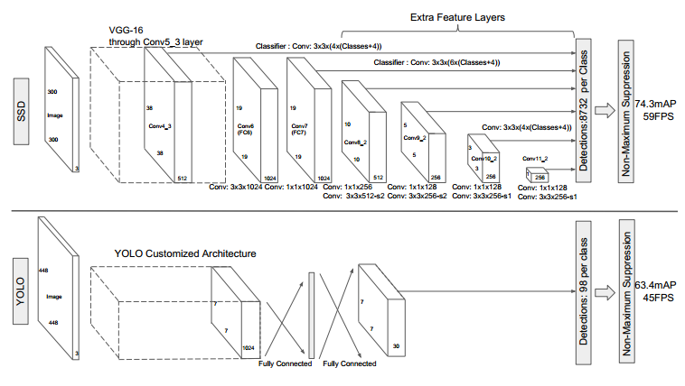
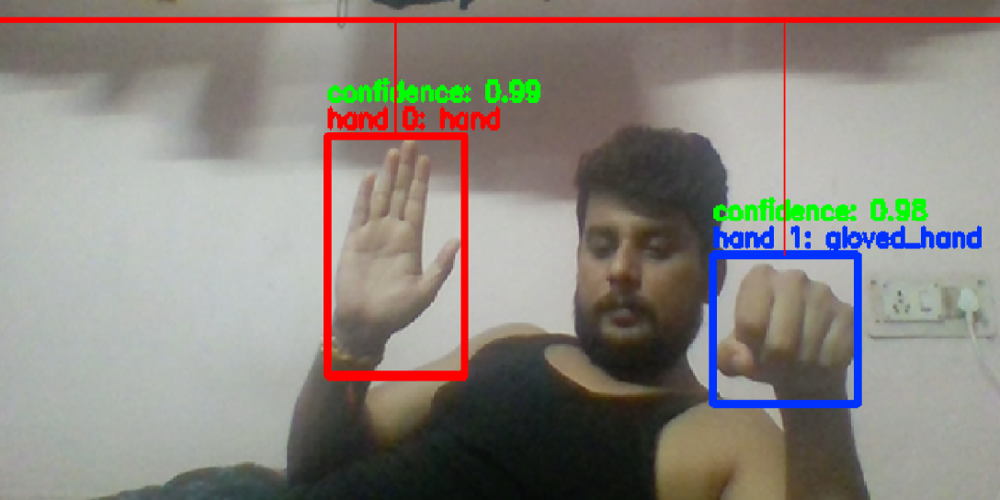
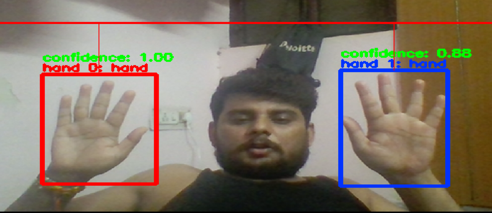

# Hand_Detection
Objective: The purpose of this project to detect a hand(Gloved and open Hand) in the image or video. If you run the hand_detection.py It will open the webcam Now It will detect the Gloved and Open hand.

# Tools Used :

Python 3.6

Tensorflow 1.14

Pycharm 2019.3

PaperSpace(To train the Model)https://www.paperspace.com/

Jupyter Notebook 

Ananconda

#Introduction
Here I have used SSD architecure , It is one of the state of the art algorithm for object detection.Due to is trade of between FPS and accuracy.
The SSD algorithm proposed in this paper is a multi-target detection algorithm that directly predicts the target category and bounding box . Compared with faster rcnn, this algorithm does not generate a proposal process, which greatly improves the detection speed. For different sizes of target detection, the traditional approach is to first convert the images into different sizes (image pyramids), then detect them separately, and finally combine the results.

The SSD algorithm uses feature maps of different convolutional layers to achieve the same effect. The main network structure of the algorithm is VGG16. The last two fully connected layers are changed to convolutional layers, and then four convolutional layers are added to construct the network structure.

Wherein the output of the convolution of 5 different layers (feature map) each with two different 3 × 3 convolution kernel for convolution output a classification of confidence , each default box generates confidence categories 21; a Output localization for regression, each default box generates 4 coordinate values (x, y, w, h). In addition, these five feature maps also generate a priority box (the coordinates are generated) through the PriorBox layer. The number of default boxes for each layer in the above five feature maps is given (8732). Finally, the first three calculation results are combined and passed to the loss layer.

#Architecture

#Output

